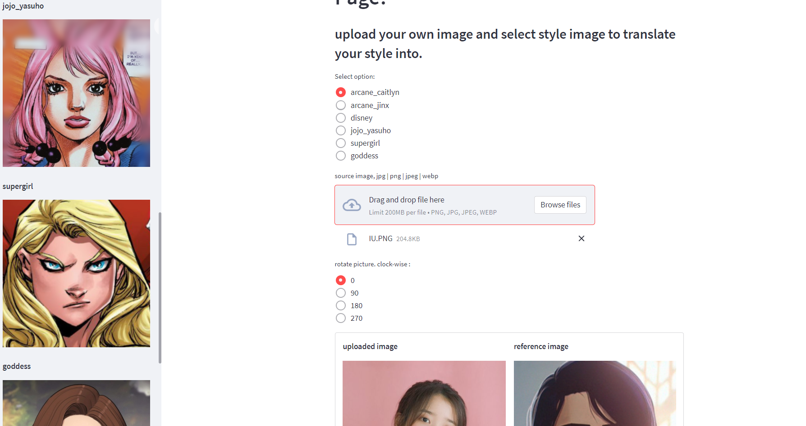

# This repo is a simple frontend web server for JoJoGAN

you will only have to install streamlit library to proceed.

you can add your own model by 

1. adding image under style_images_aligned/ directory
2. model file under models/ 
3. add enum variable with the name of the file without extension in FaceOption class

by doing so, you will see the your added image in the left side bar and select option




[Sample Link](http://aifolio.cafe24.com/test/)

The link above won't accept many requests and may be slow.

Download the code and make it work with your own server

enjoy.


# installation

- You only need to install streamlit library and what JoJoGAN requires

# RUN

running streamlit server is a bit different from normal command.

streamlit run streamlit_jojogan.py --server.port 8951


# JoJoGAN: One Shot Face Stylization
[](https://arxiv.org/abs/2112.11641)
[](https://colab.research.google.com/github/mchong6/JoJoGAN/blob/main/stylize.ipynb)
[](https://huggingface.co/spaces/akhaliq/JoJoGAN)


This is the PyTorch implementation of [JoJoGAN: One Shot Face Stylization](https://arxiv.org/abs/2112.11641).


>**Abstract:**<br>
While there have been recent advances in few-shot image stylization, these methods fail to capture stylistic details
that are obvious to humans. Details such as the shape of the eyes, the boldness of the lines, are especially difficult
for a model to learn, especially so under a limited data setting. In this work, we aim to perform one-shot image stylization that gets the details right. Given
a reference style image, we approximate paired real data using GAN inversion and finetune a pretrained StyleGAN using
that approximate paired data. We then encourage the StyleGAN to generalize so that the learned style can be applied
to all other images.

## Updates
* `2021-12-26` Added wandb logging. Fixed finetuning bug which begins finetuning from previously loaded checkpoint instead of the base face model. Added art model
<br>
* `2021-12-25` Added arcane_multi model which is trained on 4 arcane faces instead of 1 (if anyone has more clean data, let me know!). Better preserves features <details></details>
* `2021-12-23` Paper is uploaded to [arxiv](https://arxiv.org/abs/2112.11641).
* `2021-12-22` Integrated into [Huggingface Spaces 🤗](https://huggingface.co/spaces) using [Gradio](https://github.com/gradio-app/gradio). Try it out [](https://huggingface.co/spaces/akhaliq/JoJoGAN)
* `2021-12-22` Added pydrive authentication to avoid download limits from gdrive! Fixed running on cpu on colab.


## How to use
Everything to get started is in the [colab notebook](https://colab.research.google.com/github/mchong6/JoJoGAN/blob/main/stylize.ipynb).

## Citation
If you use this code or ideas from our paper, please cite our paper:
```
@article{chong2021jojogan,
  title={JoJoGAN: One Shot Face Stylization},
  author={Chong, Min Jin and Forsyth, David},
  journal={arXiv preprint arXiv:2112.11641},
  year={2021}
}
```

## Acknowledgments
This code borrows from [StyleGAN2 by rosalinity](https://github.com/rosinality/stylegan2-pytorch), [e4e](https://github.com/omertov/encoder4editing). Some snippets of colab code from [StyleGAN-NADA](https://github.com/rinongal/StyleGAN-nada)
